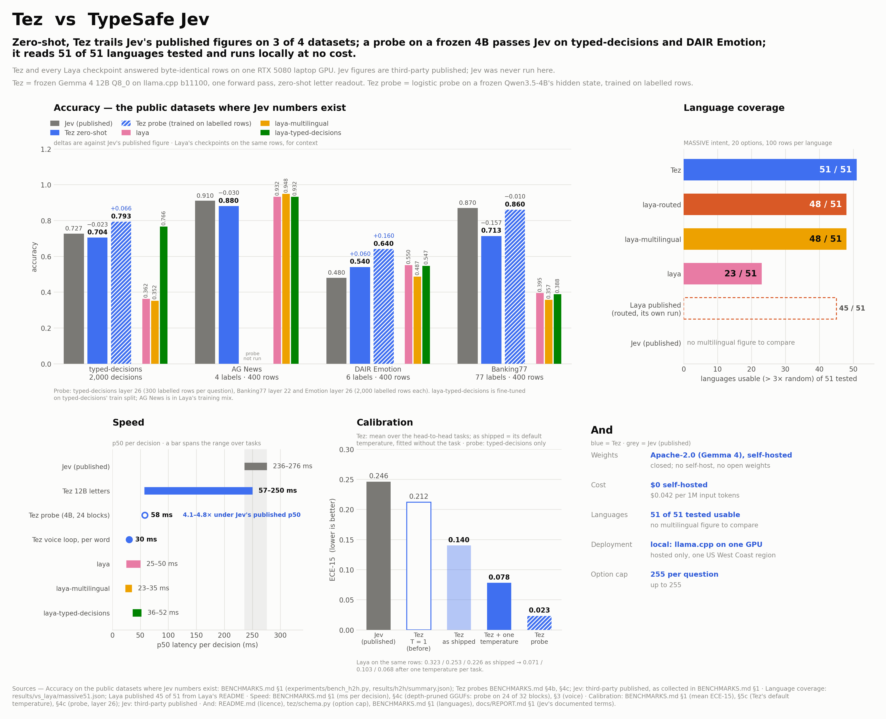

# Tez benchmarks

Every number here was measured on one machine (RTX 5080 Laptop 16 GB, llama.cpp b11100, Gemma 4 12B Q8_0 unless stated), frozen, zero training. Laya's three checkpoints answered **byte-identical rows on the same GPU**; SemIf's published figures are on SemIf's own public fixtures; **Jev was never run here** (closed API) — its figures are third-party published and marked as such. Raw rows and manifests: `results/`. Figures: `docs/figures/`, all-in-one: `docs/figures/tez_dashboard.png`.

---

## 1. Same rows, same machine: Tez vs Laya (Laya's own benchmarks)

`experiments/bench_h2h.py`. MASSIVE follows Laya's protocol (20 options = gold + 19 sampled, seed 13, first 100 test rows per language). Banking77 uses a chunked tournament for Tez (77 > 26 letters; four chunks of 20 + "none", winners meet in a final). Laya runs in-process with its shipped temperatures.

| task (n) | **Tez zero-shot** | laya | laya-multilingual | laya-typed-decisions | Jev (published) |
|---|---:|---:|---:|---:|---:|
| AG News (400; in Laya's training mix) | 0.880 | **0.932** | 0.948 | 0.932 | 0.910 |
| DAIR Emotion (400) | 0.540 | **0.550** | 0.487 | 0.547 | 0.480 |
| Banking77 (400, 77 options) | **0.713** | 0.395 | 0.357 | 0.388 | 0.870 |
| SST-5 (400, ordinal score) | **0.512** | 0.362 | 0.280 | 0.460 | — |
| BoolQ (400, noul; in Laya's mix) | **0.850** | 0.843 | 0.782 | 0.835 | — |
| prompt-injections (116, noul, held out) | **0.759** | 0.672 | 0.569 | 0.647 | — |
| MASSIVE intent, English (100, 20 options) | **0.900** | 0.830 | 0.710 | 0.820 | — |
| XNLI, English (100) | 0.730 | 0.900 | 0.860 | **0.920** | — |
| typed-decisions (400 cases, 2,000 decisions) | **0.704** (4-shot in cached prefix: **0.725**) | 0.362 | 0.352 | 0.766 † | 0.727 |
| … soft accuracy vs teacher distribution | **0.575** (4-shot **0.583**) | 0.331 | 0.328 | 0.471 | 0.580 |
| … Brier vs teacher distribution | 0.355 | 0.316 | 0.463 | **0.061** | 0.148 |
| … score MAE | 0.482 | 0.694 | 0.761 | **0.242** | 0.391 |

† fine-tuned on this benchmark's own training split (Laya's own caveat). Laya's published numbers reproduce in this harness (base 0.362 / 0.362, fine-tuned 0.766 / 0.766, Khmer 0.000 / 0.000), which validates the comparison.

**typed-decisions by workflow (Tez / laya-td):** agent-trace observability 0.592 / 0.732 · customer service 0.768 / 0.764 · invoice processing 0.768 / 0.804 · security incidents 0.688 / 0.766. **By primitive (Tez):** noul 0.81 · choice 0.68 · score 0.64.

### Languages — MASSIVE intent, 20 options, 100 cases each

| lang | **Tez** | laya | laya-multilingual | laya-td |
|---|---:|---:|---:|---:|
| en | **0.900** | 0.830 | 0.710 | 0.820 |
| de | **0.870** | 0.420 | 0.500 | 0.390 |
| fr | **0.870** | 0.590 | 0.600 | 0.590 |
| es | **0.890** | 0.510 | 0.580 | 0.460 |
| ja | **0.930** | 0.520 | 0.640 | 0.550 |
| zh-CN | **0.910** | 0.620 | 0.650 | 0.590 |
| ar | **0.870** | 0.120 | 0.460 | 0.080 |
| hi | **0.900** | 0.090 | 0.470 | 0.110 |
| th | **0.890** | 0.080 | 0.470 | 0.100 |
| ko | **0.910** | 0.110 | 0.470 | 0.060 |
| km | **0.790** | 0.000 | 0.210 | 0.050 |
| **macro** | **0.885** | 0.354 | 0.524 | 0.345 |
| languages > 3× random | **11/11** | 6/11 | 11/11 | 6/11 |
| macro ECE (shipped) | **0.099** | 0.487 | 0.299 | 0.338 |

### XNLI (100 per language) — the one family where Laya's trained encoder is ahead

| lang | Tez | laya | **laya-multilingual** |
|---|---:|---:|---:|
| en | 0.730 | 0.900 | 0.860 |
| de | 0.680 | 0.680 | 0.800 |
| fr | 0.650 | 0.760 | 0.850 |
| es | 0.740 | 0.800 | 0.800 |
| ar | 0.680 | 0.430 | 0.780 |
| hi | 0.710 | 0.460 | 0.710 |
| th | 0.700 | 0.390 | 0.760 |
| zh | 0.680 | 0.710 | 0.790 |
| ru | 0.710 | 0.560 | 0.780 |
| tr | 0.710 | 0.400 | 0.810 |
| **macro** | 0.699 | 0.609 | **0.794** |

### Calibration, order robustness, latency

| | Tez | laya | laya-ml | laya-td | Jev (published) |
|---|---:|---:|---:|---:|---:|
| mean ECE-15 as shipped (Tez at T = 1) | **0.212** | 0.323 | 0.253 | 0.226 | 0.246 |
| mean ECE-15, Tez's default temperature fitted without the task (§5c) | 0.140 | — | — | — | — |
| mean ECE-15 after one temperature per task (2-fold OOF) | 0.078 | 0.071 | 0.103 | **0.068** | — |
| option-order flip, MASSIVE-en (20 options) | **0.07** | 0.18 | 0.20 | 0.15 | 0.13 |
| option-order flip, Emotion / AG News | 0.07 / 0.03 | 0.06 / 0.00 | 0.16 / 0.00 | 0.06 / 0.00 | — |
| ms per decision, p50 (this GPU) | 57–250 | 25–50 | 23–35 | 36–52 | 236–276 |

Tez's per-decision time on these tasks is dominated by evaluating the **state** (it is the variable suffix); on constant-option / short-suffix workloads (the voice loop below) it is 30 ms.

---

<!-- vs_laya:start -->
## 1b. On Laya's own benchmarks: Laya's charts, redrawn with Tez

Laya publishes its comparison with Jev as a set of charts. `experiments/make_vs_figures.py` redraws each one with Tez in Laya's place (`docs/figures/vs/`, listed in its README); the measurements below fill the panels Tez had never been run on. Tez and every Laya checkpoint answered byte-identical rows; Laya's workflow scores come from Laya's own harness (CPU, fp32, as in its published run), Tez from the letter readout on the RTX 5080 laptop. Jev was never run here.

### Laya's seven application workflows (400 rows each, Laya's sampling, seed 13; `experiments/vs_laya_apps.py`)

| task | **Tez** | laya | laya-multilingual | laya-typed-decisions | Laya published (laya / multilingual / typed) |
|---|---:|---:|---:|---:|---|
| Email spam (in Laya's training) | 0.9675 | **0.9925** | **0.9925** | 0.9575 | 0.9925 / 0.9925 / 0.9575 |
| Phishing (in Laya's training) | 0.8975 | 0.980 | **0.9925** | 0.940 | 0.980 / 0.9925 / 0.940 |
| LLM guardrails (jailbreak) (held out) | **0.865** | 0.7075 | 0.805 | 0.7625 | 0.7075 / 0.755 / 0.7625 |
| Moderation (toxicity) (held out) | **0.7125** | 0.530 | 0.535 | 0.530 | 0.530 / 0.525 / 0.530 |
| RAG passage relevance (in Laya's training) | 0.610 | 0.625 | **0.6725** | 0.625 | 0.625 / 0.6575 / 0.625 |
| Support triage (10-way queue) (in Laya's training) | 0.4075 | 0.5025 | **0.540** | 0.505 | 0.5025 / 0.5225 / 0.505 |
| Model routing (domain) (held out), n = 399 | **0.9699** | 0.6391 | 0.4411 | 0.6591 | 0.6391 / 0.1228 / 0.6591 |

Tez wins the three held-out workflows; Laya wins the four in its training mix. Our reruns of laya and laya-typed-decisions match Laya's published numbers to four decimals; the released laya-multilingual checkpoint does not reproduce its published row (higher here on five tasks, most on model routing), cause not found (`results/vs_laya/apps.json`, `meta` and `reproduction`).

### MASSIVE intent in all 51 languages (20 options, 100 rows each; `experiments/vs_laya_massive51.py`)

| system | languages above 3× random (of 51) | mean accuracy |
|---|---:|---:|
| **Tez** zero-shot | 51 | 0.816 |
| laya routed (English checkpoint for en, multilingual otherwise) | 48 | 0.403 |
| laya-multilingual | 48 | 0.401 |
| laya (English) | 23 | 0.227 |

Laya's own published run counts 45 usable languages with routing (laya-multilingual 45, laya 23); our rerun of the released multilingual checkpoint scores higher in some languages (see the file's `reproduction`).

Tez beats Laya's router in every language (the smallest margin is English, 0.90 vs 0.82); its weakest are cy 0.33, is 0.62, sq 0.62, lv 0.65, hu 0.66.

### Speed per call (one state, p50; `experiments/vs_laya_speed.py`)

| system | 1 q / call | 5 q / call | 10 q / call | 50 q / call | ms per question at 50 |
|---|---:|---:|---:|---:|---:|
| **Tez** (tez serve, question first, new ticket each call) | 139 ms | 549 ms | 1,039 ms | 4,666 ms | 93.3 ms |
| laya (same GPU) | 36 ms | 50 ms | 75 ms | 370 ms | 7.4 ms |
| laya-multilingual (same GPU) | 30 ms | 33 ms | 38 ms | 141 ms | 2.8 ms |

Laya batches: its cost per question falls to 2.8–7.4 ms at 50 questions per call. Tez runs one forward pass per question. In these runs the runtime read every question first and the state after it, so the state was evaluated again for each question and the cost per question stayed near 90–140 ms. The runtime now reads two or more questions state first (`--layout auto`), so llama-server's prompt cache can keep the state for the questions after the first; the runtime's own latency over HTTP with that layout has not been measured. §5b measures the layout on direct `/completion` calls and in process.

### Selective automation on typed-decisions (accuracy on the decisions acted on, most confident first; `experiments/vs_laya_selective.py`)

| system | 30 % | 40 % | 50 % | 60 % | 70 % | 80 % | 90 % | 100 % |
|---|---:|---:|---:|---:|---:|---:|---:|---:|
| **Tez** letters (zero-shot) | 0.928 | 0.882 | 0.856 | 0.817 | 0.784 | 0.754 | 0.730 | 0.704 |
| laya-typed-decisions (fine-tuned on it) | 0.965 | 0.938 | 0.904 | 0.873 | 0.848 | 0.820 | 0.796 | 0.766 |
| laya | 0.413 | 0.430 | 0.426 | 0.422 | 0.409 | 0.386 | 0.376 | 0.362 |
| laya-multilingual | 0.477 | 0.446 | 0.411 | 0.388 | 0.369 | 0.366 | 0.354 | 0.352 |

Tez's letters read at T = 1 are over-confident (ECE-15 0.262; most answers sit in the top confidence bin); one out-of-fold temperature brings it to 0.048 on these rows (2-fold split of `bench_h2h.py`; §4c's 0.067 used the probe lab's split), and the default temperature Tez now applies to unfitted questions, fitted without typed-decisions, to 0.051 (§5c). laya-typed-decisions, fine-tuned on this benchmark, ranks its own errors better at every coverage.

<!-- vs_laya:end -->

---

## 2. SemIf's benchmark (authored144 · perturbations108), frozen models

`experiments/run_direct.py`, `metrics.py`, `calibrate.py`, `perm_analysis.py`, `run_hf.py`. Mean-family balanced accuracy, classes keyed by option id, 95 % CI by source-group bootstrap.

| Model | authored144 mfba (95 % CI) | perturbations | NLL raw → best | Brier raw → best | reversal flips / 36 | p50 |
|---|---:|---:|---:|---:|---:|---:|
| **Gemma 4 12B Q8_0** | **0.943** (0.897–0.981) | **0.992** | 0.478 → **0.158** | 0.094 → **0.075** | **0** (≤ 9.6 %) | 110 ms |
| Gemma 4 12B Q4_K_M | 0.918 (0.871–0.958) | 0.981 | 0.549 → 0.184 | 0.130 → 0.092 | 1 | 100 ms |
| Qwen3.5-4B BF16 (SemIf's model, in-process) | 0.813 (0.755–0.865) | — | 0.427 | 0.248 | — | 224 ms |
| Qwen3.5-4B + 6-permutation batch | **0.912** | — | — | — | — | 321 ms |
| Qwen3-4B BF16 (in-process) / + 6-perm | 0.740 / 0.832 | — | — | — | — | 75 / 204 ms |
| Qwen3.5-9B Q8_0 (llama.cpp, `qwen3` template) | 0.912 (0.863–0.955) | 0.868 | — | — | 3 (8 %) | 92 ms |
| Gemma 3 4B Q4_K_M | 0.646 (0.570–0.728) | 0.729 | 3.433 → 0.696 | 0.661 → 0.397 | 13 (36 %) | 40 ms |
| Llama 3.2 3B Q4_K_M | 0.358 (0.319–0.399) ≈ chance | 0.496 | 1.673 → 1.043 | 0.827 → 0.627 | 10 (28 %) | 25 ms |
| *SemIf published: Qwen3.5-4B / EXL3 27B* | *0.813 / 0.958* | *0.766 / —* | | | | |

Paired McNemar on the same 144 rows: 12B Q8 vs Qwen3.5-4B p = 5e-5; 12B vs Qwen3.5-4B **with** 6-permutation averaging p = 0.18 (not significant); Q8 vs Q4 p = 0.25. SemIf's 0.813 reproduces exactly (0.8132).

**Calibration recipes (Gemma 4 12B Q8, 144 rows, OOF temperature):** raw NLL 0.478 / Brier 0.094 / ECE 0.047 · temperature 0.193 / 0.083 / 0.027 · 6-permutation mean 0.281 / 0.083 / 0.038 (best error-detection AUROC 0.933) · **6-perm + temperature 0.158 / 0.075 / 0.037** · Zhao contextual calibration accuracy **0.951 → 0.778** (harmful: empty evidence legitimately selects "insufficient"; the 3-placeholder average does not rescue it). Letter prior A/B/C = 0.331/0.336/0.333 (PriDe is a no-op). Three Q8 runs byte-identical.

---

### Backbone check: Qwen3.5-9B Q8_0 vs Gemma 4 12B Q8_0 (same rows, same harness)

| task | Qwen3.5-9B | **Gemma 4 12B** |
|---|---:|---:|
| SemIf authored144 / perturbations | 0.912 / 0.868 (8 % reversal flips) | **0.943 / 0.992** (0 %) |
| typed-decisions (2,000) / soft acc | 0.622 / 0.498 | **0.704 / 0.575** |
| MASSIVE en / ja / ar / km | 0.88 / 0.87 / 0.70 / 0.69 | **0.90 / 0.93 / 0.87 / 0.79** |
| Banking77 / SST-5 / BoolQ / prompt-injections | 0.642 / 0.430 / 0.812 / 0.621 | **0.713 / 0.512 / 0.850 / 0.759** |
| order flip, MASSIVE-en / ja | 0.09 / 0.19 | **0.07 / —** |
| JevBench public original / easy (intelligence) | 94.0 / 100 | see §5 |

The 9B saves ~3 GB and nothing else; the 12B stays the backbone.

## 3. Voice → instant action (220 commands, 16 actions)

`experiments/run_voice_fast.py`, `stream_analysis.py`, `stream_policy.py`, `residual_check.py`, `asr_bench.py`, `voice_demo.py`.

| | transcript last (used) | transcript first (control) | "still speaking" wording |
|---|---:|---:|---:|
| intent accuracy, strict / accepting then·alt | **0.905 / 0.982** | 0.877 / 0.955 | 0.868 / 0.968 |
| out-of-scope → none, recall / precision | 1.000 / **0.917** | 0.909 / 0.769 | 0.909 / 0.833 |
| per streamed word: compute / HTTP round-trip (p50) | **30 / 45 ms** | 148 / 221 ms | 30 / 45 ms |
| tokens evaluated per word | **11** | 358 | 11 |

Before `--swa-full` the server re-evaluated all 394 tokens every word (205 ms) — Gemma's sliding-window cache cannot be rolled back without it.

**Streaming (198 actionable utterances):** naive commit at p ≥ 0.9 fires `none` at word 1 (17 % accurate). Rule: a confident `none` on a prefix never commits. Non-none commit: 98.5 % commit at 0.918 accuracy, mean word 2.5 of 5.4, 93 % at/before the human commit word. **Class-aware policy** (opens fire on one partial; media/play need two; type/close at end of utterance; refinement graph open_x → play_x): **harmful actions 1/198**, final action consistent 0.985, first action at mean word 3.6, out-of-scope false actions 2/22. Compound commands as two decisions on the residual with a `prior`: 22/22.

**ASR (faster-whisper, synthetic SAPI speech, 200 ms chunks):** base.en partial p50 41 ms, WER 7.8 %, intent-from-ASR agrees with intent-from-text 97.3 %; small.en 120 ms, 7.3 %, 97.7 % — base.en is the pick. **Live from audio:** "open notes and type hello world" → Notepad launched at **+652 ms** (1.3 s before speech ends), text typed at end of speech. Per-word budget ≈ 40 ASR + 30 decide + 15 HTTP + <1 policy ≈ 85 ms.

---

## 4. Abstention, debiasing, cascades

- **Conformal sets, typed-decisions (2,000 decisions, Mondrian by question type, calibrated on half the cases):** at 90 % target coverage Tez covers 90.1 %, acts (set size 1) on **52 %** of decisions at **0.853** accuracy, escalates the rest, zero fallbacks; at 95 %: acts on 37 % at 0.912. Laya fine-tuned: 63 % at 0.876; Laya base: 5 %. (`experiments/conformal_td.py`)
- **Batch Calibration (Zhou et al. 2023), out-of-fold:** NLL improves on 30/33 sets (prompt-injections 2.89 → 1.03, XNLI-th 2.18 → 1.26, SST-5 4.04 → 3.26, typed-decisions 1.75 → 1.42); accuracy +1–4 pts on XNLI and prompt-injections, unchanged on most tasks, −4 on Khmer, −1 on typed-decisions. (`experiments/batch_calibration.py`)
- **Small→large cascade (Gemma 3 4B → 12B, escalate on ordering disagreement): negative result** — 0.854 at 117 ms vs the 12B alone 0.951 at 110 ms. (`experiments/cascade_analysis.py`)

---

## 4b. Ablations on the 12B (typed-decisions unless stated)

| lever | result |
|---|---:|
| 4 worked examples of the same question in the cached prefix (train split, no training) | 0.704 → **0.725** (p = 0.053), soft 0.583, ECE-refit 0.038 |
| thinking budget before the readout, 32 / 128 tokens (s1-style seeded thought) | 0.687 → 0.657 (n = 300, p = 0.12) / 0.753 → 0.753 (n = 150); 2.0 s / 4.3 s per decision — **null/negative** |
| thinking budget 64 tokens on the JevBench hard tier (111) | 0.703 → 0.658 (p = 0.27); temporal_numeric 0.13 → 0.27, long_policy 0.79 → 0.58; 2.6 s per decision — **negative** |
| answer symbols: digits / lowercase / uppercase letters (SemIf rows) | 0.947 / 0.943 / 0.943 — **no effect at 12B** |
| ordinal expected-value readout instead of argmax (SST-5, score questions) | no change for Tez; hurts Laya-td — **null** |
| Batch Calibration (out-of-fold) | NLL down on 30/33 sets; accuracy ±1–4 pts task-dependent |
| conformal sets (90 % coverage) | act on 52 % of decisions at 0.853 accuracy |
| 4B → 12B cascade | 0.854 @ 117 ms vs 12B alone 0.951 @ 110 ms — **negative** |

### Hidden-state probe (Hidden Calibration, `experiments/hidden_probe.py`) — frozen Qwen3.5-4B, typed-decisions

| readout | test accuracy (2,000) | NLL |
|---|---:|---:|
| letter logits (the model's own one-pass answer) | 0.490 | 1.18 |
| logreg probe on final hidden state (layer −1) | 0.772 | 0.65 |
| logreg probe, layer −4 / −8 | 0.791 / 0.792 | 0.52 / 0.51 |
| **logreg probe, layer −12** | **0.794** | **0.51** |
| nearest-centroid, layer −12 | 0.715 | — |
| Gemma 4 12B Q8, final-layer last-token state via llama-server `--embeddings --pooling last` (L2-normalised), logreg / centroid | 0.735 / 0.724 | 0.67 |

**Full layer sweep (Qwen3.5-4B, 33 layers, `hidden_probe_sweep.py`):** 0.483 (layer 0) · 0.574 (12) · 0.661 (14) · 0.737 (16) · 0.777 (18) · **0.790–0.793 (20–28, best 26)** · 0.787 (30) · 0.772 (32). **Data efficiency at layer 26 (rows per question, 3 seeds):** 10 → 0.669 · 25 → 0.707 · 50 → 0.741 · 100 → 0.760 · 200 → 0.788 · all 300 → 0.793. **Ensemble** probe ⊕ letter logits (w = 0.25): 0.799. **Conformal on the probe, 90 % coverage:** act on 66.6 % at 0.884 accuracy (12B letters: 52 % @ 0.853; laya-td: 63 % @ 0.876).

**Early readout (`early_exit_bench.py`, Qwen3.5-4B truncated to its first N layers, 200 typed-decisions prompts, 227 tokens mean, eager PyTorch bf16, CUDA-synchronised):**

| layers kept | prefill p50 | speed-up | probe accuracy at that layer |
|---|---|---|---|
| 32 (full) | 387 ms | 1.00× | 0.772 (final) |
| 28 | 351 ms | 1.10× | 0.787 |
| 24 | 296 ms | 1.30× | 0.793 |
| 20 | 250 ms | 1.54× | 0.790 |
| 16 | 200 ms | 1.94× | 0.737 |

Reading the decision at layer 20–24 keeps the probe's full accuracy and removes a third to a half of the prefill. Absolute ms are the eager PyTorch path (the GGUF server does the same prompt in ~30 ms); the ratios are what transfer.

### Probe backbone: Gemma 4 12B mid-depth vs Qwen3.5-4B (typed-decisions, same splits)

| backbone | best layer | probe acc | 50 rows/q | 200 rows/q | conformal 90 %: act / acc |
|---|---|---|---|---|---|
| Qwen3.5-4B bf16, raw features | 26 / 32 | **0.793** | 0.741 | **0.788** | 66.6 % / 0.884 |
| Qwen3.5-4B bf16, z-scored | 30 / 32 | 0.772 | 0.742 | 0.770 | 63.7 % / 0.880 |
| Gemma 4 12B NF4, z-scored (layers 0–40 of 48) | 34 / 48 | 0.787 | **0.754** | 0.772 | 66.4 % / 0.874 |
| Gemma 4 12B Q8, final layer via llama-server | 48 / 48 | 0.735 | | | |

12B layer curve (z-scored): 0.483 (0) · 0.627 (4) · 0.600 (12) · 0.662 (20) · 0.714 (26) · 0.750 (28) · 0.775 (32) · **0.787 (34)** · 0.782 (36–39) · 0.776 (40). Unscaled fits did not converge on the 12B (0.714 at layer 26, same as z-scored). The bigger backbone does not buy a better probe; the 4B stays the probe backbone.

### Task probes on Laya's public benchmarks (`hidden_probe_tasks.py`, frozen Qwen3.5-4B, 2,000 labelled train rows per task, same test rows as §1)

| task | 4B letters | 4B probe L18 | L22 | L26 | final | 12B letters (zero-shot) | laya-td (fine-tuned) | Jev (published) |
|---|---|---|---|---|---|---|---|---|
| Banking77 (77) | — | 0.688 | **0.860** | 0.848 | 0.858 | 0.713 (tournament) | 0.388 | 0.870 |
| Emotion (6) | 0.468 | 0.600 | 0.630 | **0.640** | 0.610 | 0.540 | 0.547 | |
| SST-5 (5) | 0.400 | **0.547** | **0.547** | 0.527 | 0.490 | 0.512 | 0.460 | |
| MASSIVE-en (60, full space) | — | 0.680 | **0.850** | 0.820 | 0.830 | 0.900 (20 options) | 0.820 (20 options) | |
| XNLI-en (3) | 0.790 | 0.830 | 0.830 | **0.860** | 0.840 | 0.730 | **0.920** | |
| BoolQ (2) | 0.752 | 0.880 | **0.892** | 0.890 | 0.848 | 0.850 | 0.835 | |

Supervised; compare with laya-td, not with the zero-shot columns. The MASSIVE probe chooses among all 60 intents, so it is a harder task than the 20-option rows.

### Retrieval-narrowed Banking77 (`retrieval_narrow.py`, 400 rows, 12B letter readout on the shortlist)

| shortlist | recall@k | accuracy | ms p50 | passes |
|---|---|---|---|---|
| MiniLM top-5 | 0.828 | 0.660 | 201 | 1 |
| MiniLM top-10 | 0.900 | 0.685 | 308 | 1 |
| MiniLM top-15 | 0.927 | 0.700 | 465 | 1 |
| MiniLM top-20 | 0.958 | 0.733 | 584 | 1 |
| MiniLM top-20 + "none" → tournament | 0.958 | **0.738** | 439 | 1.11 |
| serving model's own embedding, top-20 | 0.283 | 0.253 | 270 | 1 |
| chunked tournament (reference) | — | 0.713 | 589 | 5 |

MiniLM top-1 alone: 0.652. The decoder's last-token state is not a retriever (top-1 0.025).

### Option elimination (`option_elimination.py`, 12B, head-to-head rows)

| task | single | top-4 | top-8 | above-mean log-p | 95 % mass |
|---|---|---|---|---|---|
| MASSIVE-en (20) | 0.900 | 0.890 | 0.900 | 0.900 | 0.900 |
| Emotion (6) | 0.540 | 0.557 | 0.540 | 0.527 | 0.550 |
| AG News (4) | 0.880 | 0.880 | 0.880 | 0.877 | 0.877 |
| typed-decisions choice, ≥3 options (600) | 0.682 | 0.683 | 0.682 | 0.702 | 0.690 |

Negative: every change is within ±2 points and costs up to a second pass. The 95 % set keeps 1.1 options on average and drops the gold one 10–40 % of the time.

One probe per question schema, fitted on the 6,000 train decisions (same data access as laya-typed-decisions, 0.766). Above Jev's 0.727 and our 12B's 0.704 / 0.725, from a 4B with untouched weights, reading 12 layers below the top.

## 4c. Probe lab: experiments on cached hidden states (`experiments/probe_lab.py`)

Every table reuses one cache: the last-token hidden state at every layer of the frozen Qwen3.5-4B (and layers 0–40 of Gemma 4 12B, NF4) for the 8,000 typed-decisions prompts, plus the letter logits. Test split, 2,000 decisions, unless stated. Closest prior work for each idea: `docs/research/novelty-check.md`; cross-disciplinary sources: `docs/research/abstract-methods-survey.md`. Figure: `docs/figures/tez_lab.png`.

### Where to read: the zero-shot logit lens

| model | readout | test acc |
|---|---|---|
| Qwen3.5-4B | letters at the final layer (32) | 0.485 |
| Qwen3.5-4B | letters read at layer 29 through the final norm and head (layer chosen on the train split) | **0.583** |
| Qwen3.5-4B | layer 24 / 27 / 28 / 30 / 31 | 0.576 / 0.572 / 0.572 / 0.561 / 0.507 |
| Qwen3.5-4B | layer chosen per question on the train split (uses labels) | 0.629 |
| Qwen3.5-4B | layer chosen without labels by confidence (picks layer 21) | 0.269 |
| Qwen3.5-4B | DoLa, final minus layer M (best M = 16) | 0.523 |
| Gemma 4 12B NF4 | letters read at layer 36 / 38 / 40 of 48 | 0.465 / 0.600 / 0.660 |
| Gemma 4 12B Q8 | full depth, llama.cpp | 0.704 |

### Choosing the layer without labels: intrinsic dimension (TwoNN, 2,000 unlabelled train states per layer)

| Qwen3.5-4B layer | 2 | 6 | 10 | 14 | 16 | 18 | 20 | 22 | 24 | 26 | 28 | 30 | 32 |
|---|---|---|---|---|---|---|---|---|---|---|---|---|---|
| intrinsic dimension (no labels) | 8.9 | 11.1 | 12.0 | 12.7 | 12.1 | 11.1 | 9.9 | 9.8 | 9.2 | 9.3 | 9.3 | 9.8 | 10.6 |
| probe accuracy (labels) | 0.483 | 0.528 | 0.551 | 0.661 | 0.737 | 0.777 | 0.790 | 0.792 | 0.791 | 0.793 | 0.790 | 0.787 | 0.772 |

| Gemma 4 12B layer (of 48) | 6 | 14 | 18 | 22 | 26 | 28 | 30 | 32 | 34 | 36 | 38 | 40 |
|---|---|---|---|---|---|---|---|---|---|---|---|---|
| intrinsic dimension (no labels) | 5.6 | 10.0 | 8.2 | 9.4 | 10.1 | 10.5 | 10.1 | 9.9 | 9.1 | 8.8 | 8.7 | 8.5 |
| probe accuracy (labels, z-scored) | 0.600 | 0.634 | 0.646 | 0.674 | 0.714 | 0.750 | 0.761 | 0.775 | 0.787 | 0.782 | 0.782 | 0.776 |

On the 4B the dimension peaks at layers 13–14 and bottoms out at layers 24–28, exactly the probe plateau. On the 12B it peaks at layer 28 and falls to the last cached layer (40) while the probe sits on its plateau (0.776–0.788): the rule "lowest dimension after the peak" lands on the plateau for both models, exactly for the 4B and 1.1 points below the best layer for the 12B.

### Anytime depth: per-layer probes, stop when sure (gold-label probes, grid 12–28)

| rule | accuracy | mean layers used (of 32) |
|---|---|---|
| fixed layer 20 | 0.790 | 20 |
| fixed layer 26 | 0.793 | 26 |
| stop when max p ≥ 0.6 | 0.775 | 16.7 |
| stop when max p ≥ 0.7 | 0.787 | 19.2 |
| stop when max p ≥ 0.8 | 0.789 | 22.0 |
| stop when summed log-odds ≥ 2.0 | 0.777 | 18.1 |
| stop when summed log-odds ≥ 3.0 | 0.788 | 19.8 |

### Probe families on layer 26

| probe | acc |
|---|---|
| logreg on mean of L20-28 | 0.793 |
| logreg C=0.5 | 0.793 |
| logreg on concat L18+22+26+30 | 0.785 |
| logreg C=0.05 | 0.774 |
| logreg C=5 | 0.774 |
| shrinkage LDA | 0.757 |
| kNN cosine k=15 | 0.750 |
| MLP 256 (early stop) | 0.726 |
| nearest centroid (cosine) | 0.700 |

### How many numbers does a decision need? (one PCA on unlabelled train states, shared by all 20 questions)

| numbers kept | 2 | 4 | 8 | 16 | 32 | 64 | 128 | 256 | 512 | 2,560 (all) |
|---|---|---|---|---|---|---|---|---|---|---|
| PCA | 0.668 | 0.711 | 0.729 | 0.750 | 0.771 | 0.790 | 0.794 | 0.791 | 0.791 | 0.793 |
| random projection | 0.587 | 0.678 | 0.714 | 0.729 | 0.749 | 0.766 | 0.777 | 0.789 | 0.784 | |

**Is the code universal?** PCA fitted on the unlabelled states of three workflows, applied unchanged to the fourth (probes still per question):

| numbers kept | 8 | 16 | 32 | 64 | 128 |
|---|---|---|---|---|---|
| code fitted on the same workflow | 0.744 | 0.767 | 0.786 | 0.789 | 0.793 |
| code fitted on the other three workflows | 0.738 | 0.752 | 0.773 | 0.782 | 0.790 |

Full 2,560 features, same protocol: 0.793.

### Few labels: which rows to label, and what to combine them with (layer 26, 3 seeds)

| labelled rows per question | 5 | 10 | 25 | 50 |
|---|---|---|---|---|
| random rows, logistic probe | 0.592 | 0.669 | 0.707 | 0.741 |
| most typical rows first (member nearest each k-means centre) | 0.640 | 0.679 | 0.734 | — |
| random rows, mixed with the 12B's zero-shot answers (w = n/(n+10)) | 0.708 | 0.717 | 0.732 | 0.752 |
| typical rows, mixed with the 12B's zero-shot answers | **0.705** | **0.713** | **0.753** | **0.766** |
| LDA, covariance from unlabelled states | 0.445 | 0.482 | 0.514 | 0.552 |
| PCA-64 from unlabelled states + logistic | 0.592 | 0.669 | 0.710 | 0.741 |

The 12B alone scores 0.705 with no labels; 50 typical labels per question on top of it reach Laya's fully fine-tuned 0.766.

### Calibration and decision types (ECE-15 and NLL as read, then after a 2-fold out-of-fold temperature)

| readout | accuracy | ECE | ECE after temperature | NLL | choice (600) | yes/no (600) | score (800) |
|---|---|---|---|---|---|---|---|
| 12B letters (zero-shot) | 0.705 | 0.262 | 0.067 | 1.747 | 0.680 | 0.812 | 0.642 |
| 4B letters (zero-shot) | 0.489 | 0.226 | 0.120 | 1.176 | 0.583 | 0.518 | 0.398 |
| 4B lens layer 29 (zero-shot) | 0.583 | 0.161 | 0.051 | 1.087 | 0.602 | 0.692 | 0.487 |
| 12B prior + 50 typical labels/question | 0.772 | 0.028 | 0.028 | 0.556 | 0.733 | 0.853 | 0.740 |
| 4B probe L26 (all labels) | 0.793 | 0.023 | 0.011 | 0.516 | 0.767 | 0.873 | 0.752 |

A logistic probe is fitted with a proper scoring rule, so it comes out calibrated (ECE 0.023 as read; Jev's published ECE is 0.246). The gain from labels is largest on ordinal score questions (+11 points over the 12B).

### Where the remaining errors are: accuracy by how decided the benchmark's own soft label is

| max of the benchmark's soft label | 0-0.5 | 0.5-0.6 | 0.6-0.8 | 0.8-1 |
|---|---|---|---|---|
| share of test decisions | 19 % | 25 % | 31 % | 25 % |
| 4B probe | 0.560 | 0.709 | 0.849 | 0.980 |
| 12B letters | 0.472 | 0.589 | 0.739 | 0.948 |

Two backbones' probes averaged: 0.798 (4B 0.793, 12B 0.787); they agree on 83 % of decisions. Every supervised route converges on 0.79-0.80, and the errors sit where the benchmark's own labels are split.

### No human labels: probes trained on zero-shot answers

| teacher | teacher test acc | hard | soft | confident top 50 % | confident top 25 % | self-training (3 rounds) | cluster-then-label |
|---|---|---|---|---|---|---|---|
| Qwen3.5-4B's own letters | 0.489 | 0.487 | 0.484 | 0.483 | 0.476 | 0.483 | 0.490 |
| Gemma 4 12B letters | 0.705 | 0.705 | 0.709 | 0.661 | 0.592 | 0.683 | 0.686 |
| rows where the 4B and 12B agree | | 0.560 | | | | | |
| Dawid–Skene label model (12B + 4B letters + lens29) | 0.617 | 0.609 | 0.613 | | | | |

Best of layers 22 and 26 per cell. Gold-label probe for reference: 0.793. A probe trained on a teacher's answers matches the teacher; it never beats it by more than half a point.

### Stacking readouts (per-question out-of-fold log-linear pool, gold labels)

| pool | stacked logistic | geometric pool |
|---|---|---|
| probe L26 alone | 0.793 | |
| probe L26 + 12B letters | 0.798 | 0.784 |
| probe L26 + 4B letters | 0.792 | 0.785 |
| probe L26 + L22 + lens + 4B + 12B | 0.795 | 0.786 |

### Conformal selection: a bound on the error rate among the decisions it acts on (BH on conformal p-values; 50 random half/half calibration splits)

| readout | accuracy | bound 5 %: acted / realised error | bound 10 % | bound 20 % |
|---|---|---|---|---|
| 4B probe L26 (gold labels) | 0.793 | 40 % / 5.2 % | 61 % / 9.9 % | 98 % / 20.2 % |
| 12B letters (zero-shot) | 0.705 | 24 % / 5.2 % | 36 % / 10.2 % | 66 % / 20.5 % |
| 4B probe L26 (12B pseudo-labels, no human labels) | 0.703 | 0 % / 0.0 % | 0 % / 0.4 % | 54 % / 20.0 % |

The realised error tracks the bound. The pseudo-label probe has its teacher's accuracy but not a usable confidence.

### Cold start: begin zero-shot, escalate, learn from the escalations (stream = the 6,000 train decisions; held-out = test split)

Starting point: the 12B's zero-shot readout (0.705).

| threshold | policy | human labels | automated share | automated accuracy | whole stream (human answers count as correct) | probe held-out | same number of random labels |
|---|---|---|---|---|---|---|---|
| 0.6 | escalate-only (audit 0.0) | 316 | 95 % | 0.707 | 0.723 | 0.719 | 0.712 |
| 0.6 | escalate+audit (audit 0.05) | 972 | 84 % | 0.747 | 0.788 | 0.757 | 0.754 |
| 0.6 | escalate+audit (audit 0.1) | 1,396 | 77 % | 0.777 | 0.829 | 0.770 | 0.768 |
| 0.6 | audit-train (audit 0.1) | 1,337 | 78 % | 0.745 | 0.802 | 0.756 | 0.769 |
| 0.6 | typical-seed (audit 0.05) | 1,279 | 80 % | 0.784 | 0.827 | 0.763 | 0.765 |
| 0.8 | escalate-only (audit 0.0) | 2,059 | 66 % | 0.805 | 0.872 | 0.771 | 0.775 |
| 0.8 | escalate+audit (audit 0.05) | 2,724 | 55 % | 0.850 | 0.918 | 0.783 | 0.789 |
| 0.8 | escalate+audit (audit 0.1) | 2,990 | 50 % | 0.868 | 0.934 | 0.787 | 0.782 |
| 0.8 | audit-train (audit 0.1) | 2,540 | 58 % | 0.811 | 0.891 | 0.756 | 0.783 |
| 0.8 | typical-seed (audit 0.05) | 3,068 | 51 % | 0.888 | 0.943 | 0.785 | 0.778 |
| 0.9 | escalate-only (audit 0.0) | 2,987 | 50 % | 0.835 | 0.917 | 0.775 | 0.783 |
| 0.9 | escalate+audit (audit 0.05) | 3,679 | 39 % | 0.871 | 0.950 | 0.786 | 0.786 |
| 0.9 | escalate+audit (audit 0.1) | 3,944 | 34 % | 0.897 | 0.965 | 0.790 | 0.784 |
| 0.9 | audit-train (audit 0.1) | 3,473 | 42 % | 0.836 | 0.931 | 0.756 | 0.783 |
| 0.9 | typical-seed (audit 0.05) | 4,173 | 32 % | 0.929 | 0.977 | 0.794 | 0.789 |

With the 4B's own letters (0.489) as the starting point instead, labels gathered only from uncertain decisions train a worse probe than random labels: τ 0.6: 1,207 labels → 0.678 vs random 0.746; τ 0.8: 3,335 labels → 0.784 vs random 0.776; τ 0.9: 4,561 labels → 0.793 vs random 0.791; τ 0.95: 5,470 labels → 0.795 vs random 0.793.

### One head for every question (letter-position classes, masked to k options)

| layer | same workflows | unseen workflow (leave-one-workflow-out, mean of 4) | 4B letters on the same rows |
|---|---|---|---|
| 20 | 0.775 | 0.508 | 0.490 |
| 26 | 0.778 | 0.521 | 0.490 |
| 32 | 0.781 | 0.492 | 0.490 |

### A universal "is this answer right?" probe (teacher-forced answer letter, one extra token per option)

| features | same workflows | unseen workflow (mean of 4) |
|---|---|---|
| L12 | 0.513 | 0.340 |
| L12_centred | 0.512 | 0.327 |
| L16 | 0.636 | 0.464 |
| L16_centred | 0.617 | 0.464 |
| L20 | 0.688 | 0.512 |
| L20_centred | 0.679 | 0.512 |
| L24 | 0.694 | 0.602 |
| L24_centred | 0.688 | 0.557 |
| L26 | 0.711 | 0.622 |
| L26_centred | 0.703 | 0.617 |
| L28 | 0.707 | 0.606 |
| L28_centred | 0.715 | 0.591 |
| L30 | 0.718 | 0.595 |
| L30_centred | 0.727 | 0.580 |
| L32 | 0.750 | 0.534 |
| L32_centred | 0.746 | 0.490 |

### Select-and-copy attention readout (attention of the answer position to each option, full-attention layers 3, 7, …, 31)

| attention to | top-1 head | top-3 | top-5 | top-10 | heads chosen on the other workflows (top-3, mean of 4) |
|---|---|---|---|---|---|
| attention to the option letter | 0.517 | 0.503 | 0.492 | 0.483 | 0.503 |
| attention to the end of the option line | 0.526 | 0.470 | 0.475 | 0.468 | 0.470 |

### Decide, then bind: the same probes on prompts with the options reversed

| layer | 8 | 10 | 12 | 14 | 16 | 18 | 20 | 22 | 24 | 26 | 28 | 30 | 32 |
|---|---|---|---|---|---|---|---|---|---|---|---|---|---|
| options in the trained order | 0.544 | 0.551 | 0.574 | 0.661 | 0.737 | 0.777 | 0.790 | 0.792 | 0.791 | 0.793 | 0.790 | 0.787 | 0.772 |
| options reversed, same probe | 0.543 | 0.551 | 0.574 | 0.660 | 0.700 | 0.753 | 0.680 | 0.690 | 0.612 | 0.589 | 0.564 | 0.562 | 0.536 |

4B letters: 0.489 in the usual order, 0.560 reversed; reversal changes the option picked in 51 % of decisions. Probes are order-free up to layer 14 and lose 2.4 points at layer 18, 20 at layer 26: read at layer 18 when a schema may reorder its options.

### Many decisions from one forward pass (400 test rows, 5 questions each)

| layout | passes | tokens | probe L20 | probe L22 | probe L26 | zero-shot letters |
|---|---|---|---|---|---|---|
| one prompt per question (today) | 2,000 | 709,730 | 0.790 | 0.792 | 0.793 | 0.489 |
| state first, all five questions, read at each "Answer n:" | 400 | 266,746 | 0.768 | 0.768 | 0.774 | 0.522 |
| state only, one vector per row | 400 | 98,746 | 0.748 | 0.746 | 0.748 | — |

### MASSIVE: one probe trained on English only (2,000 rows), used unchanged in 11 languages (layer 20, same 100 test rows per language as §1)

| | en | de | fr | es | ja | zh-CN | ar | hi | th | ko | km | macro |
|---|---|---|---|---|---|---|---|---|---|---|---|---|
| 4B probe, 20 options (Laya's protocol) | 0.910 | 0.850 | 0.840 | 0.840 | 0.880 | 0.900 | 0.740 | 0.750 | 0.670 | 0.860 | 0.590 | **0.803** |
| 4B probe, all 60 intents | 0.850 | 0.760 | 0.760 | 0.730 | 0.770 | 0.810 | 0.620 | 0.630 | 0.520 | 0.800 | 0.480 | 0.703 |
| 12B zero-shot letters | 0.900 | 0.870 | 0.870 | 0.890 | 0.930 | 0.910 | 0.870 | 0.900 | 0.890 | 0.910 | 0.790 | 0.885 |
| laya-multilingual | 0.710 | 0.500 | 0.600 | 0.580 | 0.640 | 0.650 | 0.460 | 0.470 | 0.470 | 0.470 | 0.210 | 0.524 |
| laya (English) | 0.830 | 0.420 | 0.590 | 0.510 | 0.520 | 0.620 | 0.120 | 0.090 | 0.080 | 0.110 | 0.000 | 0.354 |

### Depth-pruned Qwen3.5-4B GGUFs served by llama.cpp (`gguf_truncate.py`, `pruned_server_bench.py`, `latency_breakdown.py`)

| blocks kept | GGUF size | zero-shot letters (= logit lens at the cut) | probe on the served state | ms / decision, letters | ms / decision, probe (embedding) |
|---|---|---|---|---|---|
| 20 of 32 | 3.06 GB | 0.269 | 0.787 | 85 | 48 |
| 24 of 32 | 3.53 GB | 0.580 | 0.793 | 104 | 58 |
| 29 of 32 | 4.13 GB | 0.580 | 0.781 | 125 | 70 |
| 32 of 32 | 4.48 GB | 0.483 | 0.776 | 136 | 84 |

Latency: dedicated runs of 100 typed-decisions prompts per server, p50, prompt caching off (llama.cpp b11100 crashes on partial prefix reuse with this hybrid architecture). Letters use `/completion` with the top-200 log-probabilities; the probe uses `/embedding`.

### Where a decision's latency goes (same 100 prompts, p50 / p90 ms)

| model | completion, n_probs 0 | completion, n_probs 20 | completion, n_probs 200 | embedding (probe readout) |
|---|---|---|---|---|
| Qwen3.5-4B, 24 of 32 blocks | 112 / 121 | 100 / 117 | 104 / 114 | 58 / 89 |
| Qwen3.5-4B, all 32 blocks | 128 / 148 | 130 / 139 | 136 / 159 | 84 / 109 |
| Gemma 4 12B Q8 | 155 / 186 | 181 / 216 | 207 / 228 | 172 / 179 |
| Qwen3.5-4B, 20 of 32 blocks | 87 / 111 | 80 / 86 | 85 / 92 | 48 / 50 |
| Qwen3.5-4B, 29 of 32 blocks | 122 / 130 | 116 / 125 | 125 / 135 | 70 / 81 |

### The cut 4B on Laya's public suite (zero-shot letters, same rows as §1, prompt caching off)

| task | 32 blocks | 29 blocks | 24 blocks |
|---|---|---|---|
| ag_news | 0.797 | 0.760 | 0.762 |
| emotion | 0.468 | 0.487 | 0.417 |
| banking77 | 0.532 | 0.517 | 0.410 |
| sst5 | 0.422 | 0.417 | 0.438 |
| boolq | 0.755 | 0.613 | 0.487 |
| prompt_injections | 0.647 | 0.586 | 0.647 |
| typed_decisions | 0.483 | 0.580 | 0.580 |
| massive:en | 0.810 | 0.720 | 0.490 |
| massive:de | 0.640 | 0.590 | 0.410 |
| massive:fr | 0.660 | 0.600 | 0.400 |
| massive:es | 0.720 | 0.580 | 0.360 |
| massive:ja | 0.760 | 0.650 | 0.410 |
| massive:zh-CN | 0.770 | 0.630 | 0.420 |
| massive:ar | 0.610 | 0.490 | 0.440 |
| massive:hi | 0.710 | 0.620 | 0.440 |
| massive:th | 0.670 | 0.590 | 0.500 |
| massive:ko | 0.730 | 0.640 | 0.380 |
| massive:km | 0.560 | 0.550 | 0.330 |
| xnli:en | 0.790 | 0.780 | 0.690 |
| xnli:de | 0.680 | 0.670 | 0.540 |
| xnli:fr | 0.710 | 0.720 | 0.520 |
| xnli:es | 0.740 | 0.770 | 0.560 |
| xnli:ar | 0.700 | 0.740 | 0.520 |
| xnli:hi | 0.650 | 0.670 | 0.530 |
| xnli:th | 0.710 | 0.680 | 0.580 |
| xnli:zh | 0.670 | 0.690 | 0.620 |
| xnli:ru | 0.730 | 0.710 | 0.510 |
| xnli:tr | 0.650 | 0.700 | 0.500 |
| **mean change vs 32 blocks** | +0.0 | -3.7 | -17.4 |

The cut helps the zero-shot letters on typed-decisions and hurts them on most public tasks: cut for probes, validate per task for letters.

### Streaming voice: a collapsing commit bound vs the fixed threshold (`voice_ddm.py`, parameters chosen on one half of the 220 utterances, scored on the other)

| log | policy | harmful / 198 | out-of-scope false / 22 | mean first-action word | first action at or before the human |
|---|---|---|---|---|---|
| partial, state last | default (τ 0.9, stability 2) | 1 | 4 | 3.87 | 0.50 |
| partial, state last | best retuned fixed threshold | 3 | 4 | 3.37 | 0.72 |
| partial, state last | best collapsing bound | 3 | 4 | 3.56 | 0.63 |
| final, state last | default (τ 0.9, stability 2) | 1 | 2 | 3.62 | 0.52 |
| final, state last | best retuned fixed threshold | 3 | 4 | 3.30 | 0.74 |
| final, state last | best collapsing bound | 1 | 2 | 3.61 | 0.52 |
| final, state first | default (τ 0.9, stability 2) | 2 | 4 | 3.57 | 0.52 |
| final, state first | best retuned fixed threshold | 3 | 4 | 3.38 | 0.70 |
| final, state first | best collapsing bound | 4 | 4 | 3.38 | 0.64 |

Neither family is both earlier and as safe as the default; the default stays.

## 5. JevBench public tiers (leaderboard formulas, `experiments/bench_jevbench.py`)

| tier (n) | Gemma 4 12B Q8: accuracy / intelligence / ECE / median s | Qwen3.5-9B Q8 |
|---|---:|---:|
| original (72) | **0.944 / 91.9 / 0.053 / 0.05 s** (paraphrase-pair consistency 0.944) | 0.958 / 94.0 / 0.069 / 0.12 s |
| easy (48) | **1.000 / 100 / 0.000 / 0.06 s** | 1.000 / 100 / 0.011 / 0.13 s |
| hard (111; states up to 3.9k tokens, 8k ctx) | **0.703 / 55.2 / 0.251 / 0.46 s** (temporal_numeric 0.13, routing_hard 1.0, trap 0.88, ambiguous 0.86, adversarial 0.83) | — |

Weighted over the three public tiers with the leaderboard's weights (hard 30 %, easy 14 %, standard 28 %; no judge tier available), Tez's intelligence is **78.2**. The leaderboard's headline uses a held-out tier plus a judge tier (Jev 85.7, SemIf 79.0, Laya 45.8), so these public numbers are indicative only. The hard tier's one collapsed family is `temporal_numeric` (2/15): date and quantity arithmetic that a single forward pass cannot do.

**Through the runtime** (`tez serve`, TypeSafe wire format, `release/jevbench/run_public.py`, 2026-09-23): standard and easy
on llama-server `-c 4096 --swa-full` (`results/jevbench_tez_server_short_warm.json`, second pass on a warm server; the first
pass after a restart had p50 0.192 s on standard, same accuracy); hard on `-c 8192` without `--swa-full`, because the full
sliding-window cache at 8k spills past 16 GB (`results/jevbench_tez_server_hard.json`; answers unchanged, every prompt
evaluated in full, so its times are pessimistic).

| tier (n) | accuracy / intelligence / ECE / median s / p95 s |
|---|---:|
| original (72) | **0.958 / 94.0 / 0.039 / 0.052 s / 0.087 s** (paraphrase-pair consistency 0.917) |
| easy (48) | **1.000 / 100 / 0.000 / 0.050 s / 0.083 s** |
| hard (111) | **0.703 / 55.2 / 0.241 / 0.716 s / 2.173 s** |

Weighted over the public tiers with the leaderboard's weights: **79.0** through the runtime (78.2 through the harness).
Indicative only; Tez has not been submitted to the leaderboard.

## 5b. Speed study: many questions about one state, probes and voice

`experiments/speed_multiq.py`, `speed_multiq_inproc.py`, `speed_probe_multiq.py`, `speed_voice.py`, `speed_overhead.py`; every table in `results/speed/tables.md`, every number in `results/speed/summary.json`, per-decision rows in `results/speed/td_rows_*.jsonl` (commit b6a8e0a). Clean reruns under a GPU lock, each with VRAM snapshots before and after (the `guard` field); earlier runs made while another process held VRAM are kept apart in `results/speed/contaminated/` and not used. Gemma 4 12B Q8_0 letters unless stated, on the production llama-server (`-c 4096 -b 512 -np 1 --swa-full --embeddings --pooling last`) or in process through llama.dll.

*Question first* is the layout the runtime used when these were measured: instructions, question and options, then the state, so every question evaluates the state again. *State first* puts the state before the question, so with prompt caching the state is evaluated once per call and each further question evaluates only its own suffix. The runtime now reads two or more questions state first (`--layout auto`), but **its own latency over HTTP with that layout has not been measured**: the state-first rows below are direct `/completion` calls or in process.

### Many questions about one state (Laya's latency protocol with distinct questions, a new ticket every call, p50 ms per call)

| engine, arm | 1 q | 5 q | 10 q | 50 q | ms per question at 50 |
|---|---:|---:|---:|---:|---:|
| tez serve, question first (the runtime as deployed when measured) | 155 | 950 | 1,786 | 10,511 | 210.2 |
| direct `/completion` per question, question first | 129 | 912 | 1,678 | 10,722 | 214.4 |
| direct `/completion` per question, state first (state cached once per call) | 158 | 495 | 752 | 4,255 | 85.1 |
| in process, sequential, state first (KV rollback) | 95 | 275 | 536 | 2,759 | 55.2 |
| in process, the state once and all question suffixes in one decode | 120 | 187 | 289 | **1,357** | **27.1** |

On the same server, direct `/completion` calls, read state first, answer 50 questions in 4,255 ms against 10,722 ms question first; for a single question state first gains nothing (158 against 129 ms). In process, with the state evaluated once and every question's suffix in one `llama_decode`, 50 questions take 1,357 ms (27 ms each). On Laya's verbatim protocol (the questions alternate a 3-option choice and a yes/no), the same rerun has tez serve, question first, at 153 / 632 / 1,199 / 5,880 ms for 1 / 5 / 10 / 50 questions, direct `/completion` state first at 152 / 437 / 856 / 4,117 ms, and the in-process single decode at 96 / 183 / 274 / 1,114 ms (22.3 ms per question at 50; laya: 7.4, §1b). Rows for other llama-server settings, including parallel slots, are in `tables.md`.

**Accuracy by layout** (typed-decisions test split, 400 rows × 5 questions = 2,000 decisions, zero-shot letters):

| layout / engine | accuracy | choice | yes/no | score | prompt tokens evaluated |
|---|---:|---:|---:|---:|---:|
| question first, direct `/completion` | 0.7050 | 0.6750 | 0.8133 | 0.6462 | 480,400 |
| state first, direct `/completion`, prompt cache | 0.7015 | 0.6583 | 0.8233 | 0.6425 | 246,784 |
| in process, the state once and all suffixes in one decode | 0.7020 | 0.6583 | 0.8250 | 0.6425 | — |
| in process, one sequence with all questions, read at markers | 0.3345 | 0.2267 | 0.5867 | 0.2263 | — |

State first and question first over HTTP agree on 81.6 % of the decisions and differ by 155 against 162 discordant answers: exact McNemar p = 0.74 (paired over `td_rows_prod_statefirst_http.jsonl` and `td_rows_prod_today_http.jsonl`, with `speed_common.mcnemar`). The in-process single decode matches state first over HTTP on 98.9 % of decisions (McNemar p = 1.0). Reading every question from one sequence at markers, so that each question also sees the ones before it, falls to 0.3345.

### Probes: one state vector for any number of questions (Qwen3.5-4B cut to 24 blocks)

| features | probe accuracy (2,000) | 1 q p50 | 50 q p50 | ms per question at 50 |
|---|---:|---:|---:|---:|
| state only, one vector per state, llama-server `/embedding` | 0.7490 | 40.9 | 41.2 | 0.82 |
| state only, one vector per state, in process | 0.7445 | 40.4 | 37.8 | 0.76 |
| state first, then the question: one vector per question, in process | 0.7845 | 45.8 | 2,103.9 | 42.08 |
| question first: one prompt per question, in process | 0.7930 | 45.1 | 6,781.2 | 135.62 |

One state-only vector answers any number of questions in about 41 ms, since each probe costs microseconds, at 0.749 against 0.793 for the per-question prompt that the runtime's probes read. The llama-server `/embedding` row is flagged by the VRAM guard's 200 MB rule because of that path's own pinned host output buffer (582 MB); 5.5 of 15.9 GB were in use, with no spill.

### Streamed voice: word to action (220 commands, 1,158 words; words after the first)

| model / engine | compute ms per word, p50 / p95 | round trip, p50 / p95 | intent accuracy | harmful / 198 | out-of-scope false / 22 |
|---|---:|---:|---:|---:|---:|
| Gemma 4 12B letters, production llama-server (§3's setting) | 33.5 / 42.8 | 41.6 / 51.6 | 0.909 | 1 | 2 |
| Gemma 4 12B letters, in process | 34.4 / 38.8 | 35.6 / 40.5 | 0.909 | 1 | 2 |
| Qwen3.5-4B 24 blocks, probe at the answer position, in process, deferred commit (trained on prefixes, 2-fold) | 18.2 / 22.9 | 19.6 / 24.4 | 0.882 | 3 | 4 |
| Qwen3.5-4B 24 blocks letters, llama-server, cache off (the runtime's Qwen setting) | 68.0 / 73.5 | 74.9 / 81.2 | 0.605 | 80 | 7 |

The clean rerun of §3's loop measures 33.5 ms compute and 41.6 ms round trip per word on the production server, against §3's 30 / 45 ms; in process the round trip is 35.6 ms. A 4B probe trained on labelled prefixes roughly halves the round trip (19.6 ms), with three harmful actions instead of one.

### One question: where the time goes (production llama-server, p50 / p95 ms)

| path | round trip |
|---|---:|
| client → tez serve → llama-server (the runtime) | 144.8 / 195.2 |
| Tez engine in process → llama-server | 145.1 / 174.7 |
| direct `/completion`, top-200 log-probabilities | 140.0 / 197.4 |
| direct `/completion`, no log-probabilities | 140.1 / 208.3 |

For one question the runtime adds about 5 ms to a direct call, including 0.4 ms in the engine and 2.3 ms in FastAPI and uvicorn (`overhead_prod.json`). Asking for 200 log-probabilities costs nothing measurable. A check of prompt-cache reuse on the cut Qwen3.5-4B GGUFs (24 and 32 blocks, seven scenarios, `speed_qwen_cache_check.py`) crashed no server on b11100 (`qwen_cache_check_L24.json`, `qwen_cache_check_L32.json`); the runtime still switches caching off for Qwen3.5 model names.

## 5c. A default letter temperature for unfitted questions

`experiments/default_temperature.py` (CPU only, saved rows only); write-up `results/calibration/default_temperature.md`, every number in `results/calibration/default_temperature.json`. The labelled decisions Gemma 4 12B Q8_0 left in `results/` (repeats, perturbed copies and other models excluded): 13,610 decisions from 19 tasks (typed-decisions, Laya's public suite, MASSIVE in 51 languages, XNLI, Laya's seven workflows, JevBench's public tiers through the runtime, SemIf and the voice router), letters read zero-shot. Read at T = 1 they are over-confident: mean confidence 0.977 against accuracy 0.768, mean ECE-15 0.218 over the tasks.

One temperature per question type, a pooled NLL fit, with choice questions split by the options shown (a tournament counts the options of its final):

| question | default T | tasks behind it | leave-one-task-out fits |
|---|---:|---:|---:|
| yes/no | **6.01** | 9 | 4.99–6.53 |
| choice, up to 10 options shown | **4.71** | 9 | 4.36–5.10 |
| choice, 11–26 options shown | **2.66** | 2 | 2.65–3.28 |
| score | **5.18** | 3 | 4.48–6.25 |

Leave-one-task-out (each task scored with temperatures fitted without it), mean over the 19 tasks:

| | T = 1 | default, held out | per-task oracle |
|---|---:|---:|---:|
| ECE-15 | 0.218 | **0.132** | 0.065 |
| NLL | 2.157 | **0.919** | 0.848 |
| Brier | 0.441 | **0.348** | 0.319 |
| mean ECE-15 over §1's 28 head-to-head entries | 0.212 | **0.140** | 0.090 |

**No argmax changes**: the most probable option is the same on all 13,610 decisions, so accuracy does not move. The probabilities around it do: yes/no probabilities move towards 0.5 without crossing it, and a score question's expected level (`score`) moves towards the middle of the scale while its most probable level stays the same. Over the 1,218 score decisions, the expected level's error against the integer gold level rises (MAE 0.439 → 0.535) while its error against typed-decisions' gold expected score falls (0.482 → 0.309). For an integer level, take the most probable level from `probabilities`, or run with `--default-temperature off`.

- **The most accurate tasks read under-confident.** Model routing (accuracy 0.970): mean confidence 0.993 → 0.645, ECE-15 0.030 → 0.325. Email spam (0.968): ECE-15 0.031 → 0.108. SemIf (0.047 → 0.067) and JevBench's 18 score items (0.182 → 0.194) also rise; every other task improves on ECE, NLL and Brier.
- **One value for all choice questions fails.** The pooled choice fit, 3.15, is set by MASSIVE (55 % of the choice decisions); held out, MASSIVE gets 4.54, its ECE-15 goes 0.153 → 0.292, and the 28-entry mean rises to 0.241, worse than T = 1. A high temperature moves probability onto implausible options: at T = 4.71, MASSIVE's 20 options put 0.343 of the probability outside each decision's four best letters; at 2.66, 0.087. The split at 10 was chosen after seeing the fits of 3–5 and 6–10 options (4.59 and 4.85), so its margin over those buckets (ECE-15 0.132 against 0.139) is small.
- **A few labels help once the fit starts from the default.** With `tez fit`'s temperature prior centred on 1, five labels give held-out NLL 1.153, worse than the default alone (0.900); centred on the default, 0.891 at five labels and 0.875 at ten. `tez fit` now centres it on the question's default.
- **Thin cells.** The 11–26 value rests on MASSIVE (96 % of the cell) and voice; the score value on three tasks, one of 18 decisions. The pool mixes easy and hard tasks and NLL follows the hard ones, so traffic of mostly easy questions (routing, spam, intent) reads under-confident until fitted.

The runtime applies the values only to Gemma 4 12B Q8_0 with the `gemma4` template, and only to letters answers that no fit calibrates; any other model is read at T = 1, and `--default-temperature off` restores T = 1. Each answer read at a default carries its `temperature` in the `tez` block. A threshold chosen on T = 1 confidences, such as §3's commit threshold (τ 0.9), needs choosing again, or `--default-temperature off`. As a check, the script reproduces §1's 0.212 at T = 1 and its 0.078 with one temperature per entry.

## 6. Audit trail

The first draft's balanced accuracy was keyed on gold *position* instead of option *id* (inflated by 1–3 points; all numbers here are corrected), and its "~110 ms floor / no prefix reuse" was the sliding-window cache (fixed with `--swa-full`). Runs that hit the wrong model are quarantined under `results/INVALID_wrongmodel_*`. Every run writes a manifest with data SHA-256, model path and settings.
