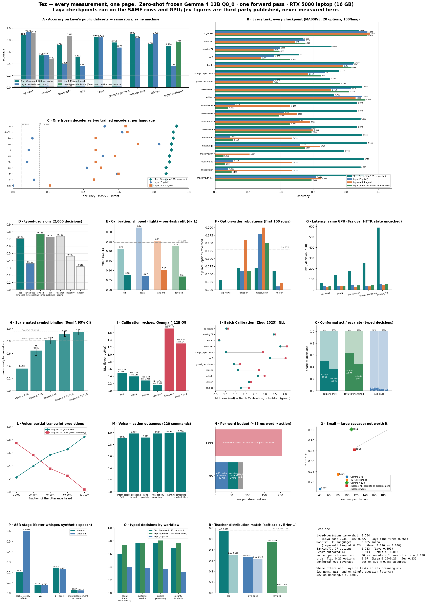
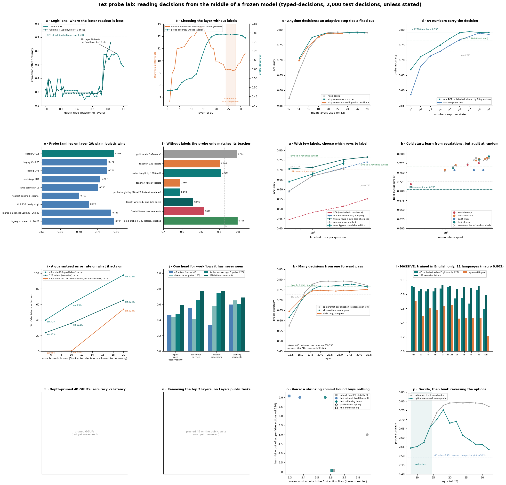

# Tez

**An open, local "System One" decision layer.** Ask a typed question — which option, yes/no, what
level — and get a probability distribution over the answers from **one forward pass** of a local
model, with a calibrated confidence and an explicit abstain/escalate contract. No tokens are
generated. Think of it as an open, self-hosted alternative to TypeSafe AI's Jev, built on the
published technique rather than on Jev's outputs (which its terms forbid).

> Status: **a runtime you can install** (`tez`: a local server that speaks TypeSafe's `/v1/systemone` wire format,
> a CLI, schemas, probes and a conformal gate) **plus the research behind it** in `experiments/`.
> Website, playground and use-case gallery: <https://jibalmi.github.io/Tez/>. Read
> [`docs/REPORT.md`](docs/REPORT.md) for the method; it was audited before release and §3.7 lists what the first
> draft got wrong.



Full tables: [`BENCHMARKS.md`](BENCHMARKS.md). Individual figures: `docs/figures/`.

## Use it

Tez sits in front of a local [llama.cpp](https://github.com/ggml-org/llama.cpp) server. The numbers below were
measured with release b11100 and Gemma 4 12B Q8_0 (Ollama's `gemma4:12b-it-q8_0`; the public equivalent is
`unsloth/gemma-4-12b-it-GGUF` / `gemma-4-12b-it-Q8_0.gguf`, not separately measured).

```
llama-server -m gemma-4-12b-it-Q8_0.gguf -ngl 99 -c 4096 -b 512 --port 8091 --host 127.0.0.1 -np 1 --no-webui --swa-full
pip install git+https://github.com/Jibalmi/Tez
tez serve --backend http://127.0.0.1:8091 --template gemma4          # listens on http://127.0.0.1:8787

curl http://127.0.0.1:8787/v1/systemone -H 'Content-Type: application/json' -d '{
  "state": "Help! My payouts have been failing for 3 days.",
  "questions": {"topic": {"type": "choice", "instructions": "What is the message about?",
    "criteria": {"billing": "Payments, payouts, invoices", "technical": "Something is broken", "sales": null}}}}'
```

- The wire format, schema files, readouts and the gate: [`docs/API.md`](docs/API.md).
- Ten worked use cases (schemas, sample inputs, the evidence behind each): [`examples/usecases/`](examples/usecases/).
- Python: `from tez import Tez; Tez(backend="http://127.0.0.1:8091").decide(state, questions=...)`
  ([`examples/quickstart.py`](examples/quickstart.py)).
- Learn from labels: `tez suggest` picks the most typical rows to label first; `tez fit` trains per-question probes,
  temperatures and conformal thresholds; `tez eval` reports accuracy and ECE.

## What we measured

Frozen models, zero training, SemIf's exact prompt and public fixtures (144 three-option decisions),
RTX 5080 laptop. Mean-family balanced accuracy, classes keyed by option id, 95 % CI by source-group
bootstrap:

| Model | Authored | Perturbation | NLL (raw → best) | Reversal flips / 36 | p50 fresh |
|---|---:|---:|---:|---:|---:|
| **Gemma 4 12B Q8_0** | **0.943** (0.897–0.981) | **0.992** | 0.478 → **0.158** | **0** (≤ 9.6 %) | 110 ms |
| Gemma 4 12B Q4_K_M | 0.918 (0.871–0.958) | 0.981 | 0.549 → 0.184 | 1 | 100 ms |
| Qwen3.5-4B BF16 (SemIf's model, reproduced in-process) | 0.813 | — | 0.427 | — | 224 ms* |
| Qwen3.5-4B + 6-permutation average, one batch | **0.912** | — | — | — | 321 ms* |
| Gemma 3 4B Q4_K_M | 0.646 | 0.729 | 3.433 → 0.696 | 13 (36 %) | 40 ms |
| Llama 3.2 3B Q4_K_M | 0.358 (≈ chance) | 0.496 | 1.673 → 1.043 | 10 (28 %) | 25 ms |
| SemIf published: Qwen3.5-4B / EXL3 27B | 0.813 / 0.958 | 0.766 / — | — | — | — |

\* transformers, not llama.cpp. Best calibration recipe: **six-ordering permutation average +
out-of-fold temperature** (Q8: NLL 0.158, Brier 0.075, error-detection AUROC 0.906). Paired tests:
12B vs SemIf's 4B p < 10⁻⁴; 12B vs the 4B *with* permutation averaging p = 0.18 — roughly half the
"scale" gap is removable option-order bias. Q4 vs Q8: p = 0.25.

**Voice → action, built and measured** (220 spoken commands, 16 actions, Gemma 4 12B Q8_0):
intent accuracy **0.905** (0.982 accepting the second action of compound commands); out-of-scope
recall 1.00 / precision 0.92; **30 ms compute / 45 ms round-trip per streamed word** because the
action list is a cached prefix and only the transcript is re-evaluated (`--swa-full` is what makes
llama-server actually reuse it); class-aware early commit: **1 harmful action in 198 utterances**,
Notepad open at +652 ms into "open notes and type hello world" from audio; compound commands scored
as two decisions on the residual: 22/22. ASR (faster-whisper base.en): 7.8 % WER on synthetic
speech, 97 % intent agreement with the true text.

**Head-to-head with Laya** (the open encoder-based "System One" that claims to beat Jev), its three
checkpoints and Tez on byte-identical rows, same GPU, Laya's own datasets and protocol
(`experiments/bench_h2h.py`, figures in `docs/figures/`):

| task | **Tez (zero-shot)** | laya | laya-multilingual | laya-typed-decisions | Jev (published) |
|---|---:|---:|---:|---:|---:|
| typed-decisions, 2,000 decisions (zero-shot / 4 examples in the cached prefix) | **0.704 / 0.725** | 0.362 | 0.352 | 0.766 (fine-tuned on its train split) | 0.727 |
| typed-decisions, linear probe on the frozen **Qwen3.5-4B**'s hidden state (per-question logreg on the train split; no LLM training) | **0.794** (4B letter readout alone: 0.490) | | | 0.766 | 0.727 |
| … soft accuracy vs teacher distribution | **0.575 / 0.583** | 0.331 | 0.328 | 0.471 | 0.580 |
| Banking77 (77 options) | **0.713** | 0.395 | 0.357 | 0.388 | 0.870 |
| Banking77, linear probe on the frozen Qwen3.5-4B (2,000 labelled rows; supervised) | **0.860** (one pass) | | | 0.388 | 0.870 |
| MASSIVE intent, macro over 11 languages | **0.885** | 0.354 | 0.524 | 0.345 | — |
| … Khmer | **0.790** | 0.000 | 0.210 | 0.050 | — |
| SST-5 / BoolQ / prompt-injections | **0.512 / 0.850 / 0.759** | 0.362 / 0.843 / 0.672 | 0.280 / 0.782 / 0.569 | 0.460 / 0.835 / 0.647 | — |
| AG News / XNLI-en (in Laya's training mix) | 0.880 / 0.730 | **0.932** / 0.900 | 0.948 / 0.860 | 0.932 / **0.920** | 0.910 / — |
| order flip at 20 options | **0.07** | 0.18 | 0.20 | 0.15 | 0.13 |
| ECE as shipped → per-task refit (mean) | 0.212 → 0.078 | 0.323 → 0.071 | 0.253 → 0.103 | 0.226 → 0.068 | 0.246 |
| ms per decision (p50, this GPU) | 57–250 | 25–50 | 23–35 | 36–52 | 236–276 |

Laya's published numbers reproduce in our harness (its base 0.362, fine-tuned 0.766, Khmer 0.000),
so the comparison is controlled. Zero-shot Tez wins six of nine English tasks and every language;
Laya wins where it was trained (AG News, NLI) and on single-question latency.

Findings worth knowing before you build anything like this:

- **The frozen model knows more than its letter logits say.** A per-question linear probe on the frozen
  Qwen3.5-4B's hidden state (12 layers below the top) scores **0.794** on typed-decisions — above Laya's
  fine-tuned 0.766 and Jev's 0.727 — from a model whose own one-pass letter readout gets 0.49. Minutes of
  logistic regression, no LLM training, and the top third of the network can be skipped.
- **Reading early is cheap latency.** Truncating the 4B to 20–24 of its 32 layers cuts prefill 1.30–1.54× with
  no loss in probe accuracy. The same probe recipe on Laya's tasks beats Laya's fine-tuned checkpoint on five of six,
  and reaches 0.860 on Banking77 (Jev 0.870) in one pass.
- **Two cheap levers barely moved.** A MiniLM shortlist lifts Banking77 from 0.713 to 0.738 in 1.1 passes;
  eliminate-then-rescore (PoE) is within ±2 points everywhere and is recorded as negative.
- **Worked examples in the cached prefix are free accuracy** (+2 pts on 2,000 decisions, +5 on schema-specific
  questions); thinking budgets before the readout, ordinal expected-value readouts and digit/lowercase answer
  symbols are null or negative at 12B.
- **Symbol-logit decisions are scale-gated.** A 3B model is at chance with 28 % order sensitivity
  and no calibration trick recovers it; a 4B sits at 0.646 with a third of decisions flipping under
  option reversal. Screen the backbone for symbol binding first.
- **Permutation averaging is the cheapest accuracy in the stack**: +10 points on Qwen3.5-4B, +7 on
  Gemma 3 4B, in one batched forward pass.
- **Zhao et al. contextual calibration is harmful here** (0.951 → 0.778, and averaging three
  placeholders does not rescue it): with the evidence blanked the model *correctly* answers
  "insufficient", so dividing that out deletes real answers. Never apply it to option sets that
  contain an abstain-style answer.
- **Prompt layout is a systems decision**: constant material first, variable last. Transcript-last
  cut per-word latency 7× *and* raised accuracy (0.868 → 0.905).
- **A confident `none` on a partial transcript means "keep listening", never "do nothing"** — the one
  rule that makes early commit work.

## The probe lab: reading decisions from the middle of the network



A second round asked what makes the mid-depth probe usable on *any* schema, borrowing methods from other fields
(two commissioned notes: `docs/research/abstract-methods-survey.md`, `docs/research/novelty-check.md`).
Almost everything runs on one cache of every layer's hidden state (`experiments/probe_lab.py`); full tables in
`BENCHMARKS.md` §4c, discussion in the paper's probe-lab section.

What worked:

- **The best layer can be found with no labels.** The intrinsic dimension of unlabelled states (TwoNN) bottoms
  out at layers 24–28 of the 4B, exactly the probe's accuracy plateau (0.79); confidence, the obvious
  alternative, picks the wrong layer.
- **On typed-decisions, the 4B's top three layers cost ten points of zero-shot accuracy.** Its letter readout scores
  0.583 at layer 29 and 0.485 at the top. It does not generalise: on Laya's public suite the same cut lowers the
  letters by 3.7 points on average, and the 12B keeps improving to full depth.
- **Cut the served model where the decision is made.** `experiments/gguf_truncate.py` keeps the first 24 of 32 blocks: a probe on the served state scores 0.793 (full model 0.776) at 58 vs 84 ms, from a 3.53 GB file. The zero-shot letters gain 10 points on typed-decisions but lose 17.4 on average across Laya's public suite (3.7 at 29 blocks): cut for probes, validate per task for letters.
- **On the 4B the most accurate readout is also the fastest.** Same prompts, caching off: a probe on the 24-block model decides in 58 ms (0.793), the full model's letters take 136 ms (0.483), the 12B's letters 207 ms (0.705).
- **Decide first, bind later, measured.** A probe trained on the usual option order still works on reversed options
  up to layer 14 (no loss) and 18 (−2.4 points), but loses 20 points at layer 26: read at layer 18 if a schema
  may reorder its options.
- **A decision needs 64 numbers.** One PCA learned from unlabelled traffic keeps 0.790 of 0.793, and a PCA learned
  on other workflows keeps 0.782 on a new one.
- **Label the typical rows first, and keep the zero-shot prior.** 50 typical labels per question on top of the 12B's
  zero-shot answers reach 0.766, the level of Laya's checkpoint fine-tuned on the whole train split.
- **Calibrated as it comes.** A logistic probe is fitted with a proper scoring rule: ECE 0.023 as read, against 0.262
  for the 12B's raw letters and 0.246 published for Jev.
- **A guaranteed error rate.** Conformal selection acts on 40 % of decisions with at most 5 % wrong (realised 5.2 %).
- **Cold start works when the prior is strong.** Starting from the 12B zero-shot, escalating the unsure 5 % and
  learning from them automates 95 % at 0.707; with a 10 % random audit slice it automates 77 % at 0.777.
- **Many decisions from one pass.** Five questions after one state, each read at its own marker: 2.7× fewer
  tokens for 1.5 points; later questions are not hurt by earlier ones.
- **Train in English, use in eleven languages.** A MASSIVE probe trained on English rows only scores 0.803 macro over
  11 languages (Laya's multilingual model 0.524); within 1–5 points of the 12B zero-shot on European and CJK
  languages, 13–22 below on Arabic, Hindi, Thai and Khmer.
- **Deciding on a workflow it has never seen.** A single "is this answer right?" probe, read at a forced answer token
  and trained on three workflows, scores 0.622 on the fourth (the 4B's own letters: 0.490; the 12B: 0.705);
  a question-agnostic letter probe does not transfer (0.521).
- **The benchmark is now the limit.** Every supervised route lands at 0.79–0.80. Where the benchmark's own label
  distribution is decisive the probe is right 98 % of the time; where the benchmark's labels are split it is right 56 %.

What did not: probes trained on zero-shot answers only match their teacher (0.709 vs 0.705); a Dawid–Skene label
model over several readouts (0.617); uncertainty-only labelling from a weak prior (worse than random labels);
batch calibration of the teacher; DoLa; adaptive depth (ties a fixed cut); LDA with an unlabelled covariance;
select-and-copy attention heads (0.50–0.53, the letters' level); a collapsing commit bound for voice.

## Layout

```
tez/                             the runtime: server, CLI, schemas, prompts, backends, readouts, fit, gate, truncate
tests/                           pytest suite (live tests skip when no llama-server is running)
docs/API.md                      the wire format, schema files, readouts and the gate
examples/usecases/               ten use cases: schema.yaml, samples.jsonl, evidence and limits (usecases.json)
site/                            the website (static; deployed to GitHub Pages by .github/workflows/pages.yml)
release/hf/                      Hugging Face model card and upload script for the 24-block Qwen3.5-4B GGUF
release/jevbench/                JevBench runner through the wire format, stub server, submission draft
experiments/record_site_*.py     recorded traces and replays used by the website
docs/REPORT.md                   the write-up: mechanism, papers, experiments, audit, voice loop, roadmap
docs/research/RESEARCH-NOTES.md  the seven commissioned literature surveys, with links
experiments/run_direct.py        symbol-logit readout via llama-server, SemIf-compatible prompt
experiments/run_hf.py            in-process transformers readout: fresh / prefix reuse / batched permutations
experiments/metrics.py           balanced accuracy (by option id) + CIs, NLL/Brier/ECE, paired perturbation stability
experiments/calibrate.py         temperature (OOF), contextual calibration, permutation averaging, risk–coverage, AURC, AUROC
experiments/perm_analysis.py     all six orderings: 2/6-perm averaging, PriDe prior, Zhao 3-placeholder + damping
experiments/run_voice.py         voice intents with SemIf's payload (transcript first) — the slow control
experiments/run_voice_fast.py    transcript-LAST prompt with KV prefix reuse; full + word-by-word streaming
experiments/stream_analysis.py   commit policies on streaming trajectories (naive vs non-none rule)
experiments/stream_policy.py     class-aware commit/refine policy: harmful-action rate, time to first action
experiments/residual_check.py    compound commands as two decisions on the residual (+ prior)
experiments/voice_actions.py     deterministic slot extraction + OS executors (dry-run by default)
experiments/asr_bench.py         faster-whisper partial latency, WER, ASR-vs-text intent agreement
experiments/tts_wavs.py          Windows SAPI synthesis of the 220 commands to 16 kHz WAV
experiments/voice_demo.py        live loop: --text / --wav / --mic → ASR partials → decision → commit → action
experiments/bench_h2h.py         Laya's public benchmarks (AG News, Emotion, Banking77, SST-5, BoolQ, prompt-injections,
                                 MASSIVE ×11 languages, XNLI ×10, typed-decisions) — same rows through Tez and the Laya checkpoints
experiments/make_h2h_plots.py    the comparison figures (docs/figures/)
experiments/make_dashboard.py    the all-in-one dashboard (docs/figures/tez_dashboard.png)
experiments/run_h2h_all.ps1      detached runner for the whole head-to-head chain
experiments/bench_jevbench.py    JevBench public tiers (data/jevbench/) with the leaderboard's intelligence/speed formulas
experiments/conformal_td.py      Mondrian split-conformal act/escalate sets on typed-decisions
experiments/batch_calibration.py Batch Calibration (Zhou 2023) applied offline, out-of-fold
experiments/cascade_analysis.py  small→large cascade (negative result)
experiments/fewshot_td.py        k worked examples in the cached prefix (zero training)
experiments/think_td.py          "System 1.5": a seeded thinking budget before the readout
experiments/backend.py           llama-server / Ollama backends (TEZ_BACKEND, TEZ_TEMPLATE, TEZ_OLLAMA_MODEL)
docs/research/*-survey.md        commissioned literature surveys: speed, accuracy, models & landscape
experiments/probe_lab.py         the probe lab on cached hidden states: label-free probes, anytime depth, probe families,
                                 decision-code size, universal heads, cold start, logit lens, label model, few labels,
                                 conformal selection, stacking, typicality, intrinsic dimension, code transfer, prior
experiments/teacher_labels.py    the 12B's zero-shot answers on typed-decisions train+test (free pseudo-labels)
experiments/probe_multiq.py      many decisions from one forward pass (markers) and a state-only pass
experiments/probe_crosslingual.py  English-only MASSIVE probe applied to 11 languages
experiments/probe_truth.py       universal "is this answer right?" probe, leave-one-workflow-out
experiments/probe_order.py       decide-then-bind across depth: probes on reversed option order
experiments/attn_readout.py      select-and-copy attention readout (negative)
experiments/gguf_truncate.py     keep the first N blocks of a GGUF (depth pruning)
experiments/pruned_server_bench.py  letters and served-embedding probes on the pruned GGUFs
experiments/latency_breakdown.py where a decision's latency goes: /completion (n_probs 0/20/200) vs /embedding
experiments/voice_ddm.py         collapsing commit bound for streaming voice (negative)
experiments/make_lab_figure.py   the probe-lab figure (docs/figures/tez_lab.png)
experiments/lab_tables.py        the probe-lab tables in BENCHMARKS.md, generated from results/
docs/research/abstract-methods-survey.md  cross-disciplinary methods for the readout (verified ids)
docs/research/novelty-check.md   closest prior work for every probe-lab experiment
BENCHMARKS.md                    every number, consolidated
experiments/probe_gemma.py       template / tokenizer / logit probe for a GGUF
data/semif/                      SemIf's MIT fixtures and core.py (prompt construction), vendored
data/voice/                      16 intents, 220 labelled commands (styles, slots, commit word), synthesised wavs
results/                         run outputs + manifests (data SHA-256, model path, settings, latency)
tools/                           llama.cpp release binaries and downloaded GGUFs (not committed)
```

## Reproduce

Needs a llama.cpp release build (b11100 `win-cuda-13.4` was used) and a Gemma 4 12B GGUF.

```
llama-server.exe -m <gguf> -ngl 99 -c 2048 -b 512 --port 8091 --host 127.0.0.1 -np 1 --no-webui --swa-full
curl http://127.0.0.1:8091/props        # assert model_path before every run — see REPORT §3.6

py experiments/run_direct.py --data data/semif/authored144.jsonl --out results/a.jsonl --template gemma4
py experiments/run_direct.py --data data/semif/authored144.jsonl --out results/a_rev.jsonl --reverse
py experiments/run_direct.py --data data/semif/authored144.jsonl --out results/a_cf.jsonl --content-free
py experiments/run_direct.py --data data/semif/perturbations108.jsonl --out results/p.jsonl
py experiments/metrics.py   --pred results/a.jsonl
py experiments/metrics.py   --pred results/p.jsonl --base results/a.jsonl
py experiments/calibrate.py --pred results/a.jsonl --cf results/a_cf.jsonl --rev results/a_rev.jsonl

py experiments/run_voice_fast.py --variant final --order last --out results/vf.jsonl
py experiments/stream_policy.py  --stream results/vf_stream.jsonl --full results/vf.jsonl
py experiments/voice_demo.py     --text "open notes and type hello world"     # dry run; --execute to act
```

Traps we hit (details in the report §3.6): prebuilt `llama-cpp-python` wheels use AVX-512; Ollama
caps `top_logprobs` at 20 and its `/v1` endpoint drops logprobs; Gemma 4 is a thinking model and
needs the empty thought channel in the prompt; bare and space-prefixed letters are different tokens;
`taskkill /IM` silently fails under Git Bash; **sliding-window models silently re-evaluate the whole
prompt unless `--swa-full` is set — check `timings.prompt_n`**; CTranslate2 needs the CUDA 12 DLLs
registered with `os.add_dll_directory` next to a CUDA 13 torch.

## Roadmap (short)

1. Backbone by MCSB screen (Gemma 4 12B passes; Q8_0 for calibration-grade probabilities; a 4B with
   batched permutation averaging is the budget option).
2. Six-ordering permutation averaging in one batch; per-schema temperature; Mondrian conformal →
   act / escalate / fall back.
3. Prompt layout as part of the schema (constant first, variable last, `prior` for multi-step);
   prefix reuse verified by `prompt_n`.
4. Decision log + shadow-eval loop; sample auto-acted cases to humans too.
5. Jev-compatible wire format with implicit `__none__`, `p_correct` and a calibration id: **done** (`tez serve`).
   Still open: `multi` and a streaming/early-commit contract with action classes.
6. Optional, last: LoRA on Gemma 4 12B *base*, proper scoring rule, gated on an OOD hold-out.

## Licence

MIT (see `LICENSE`). Vendored SemIf material is MIT (TheoLeeCJ). Gemma 4 is Apache-2.0.
faster-whisper/CTranslate2 and Whisper weights are MIT. Not affiliated with TypeSafe AI; nothing here
was trained on or derived from Jev outputs.
